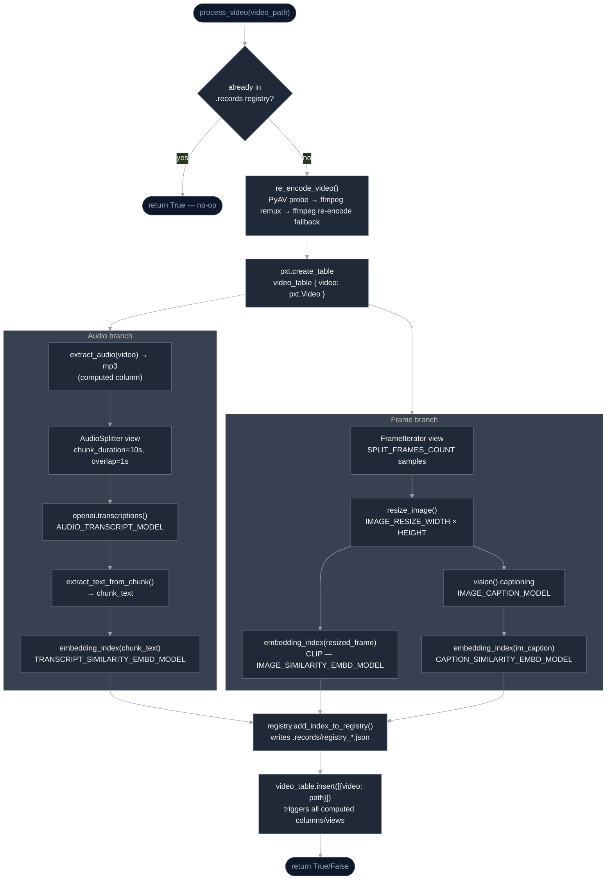
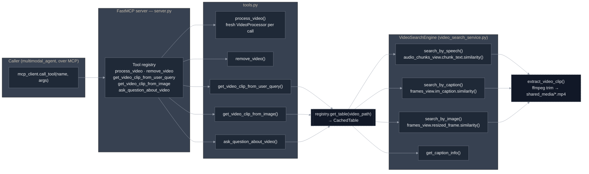

# video_mcp_server

A [FastMCP](https://gofastmcp.com) server (streamable-http transport) that
owns all video ingestion, indexing, multimodal search, and clip extraction.
Exposes tools/resources/prompts over MCP; consumed by `multimodal_agent`.

This service has no notion of "conversation" — it takes a video path and a
query (text or image) and returns either a clip path or relevant captions.
Everything conversational lives upstream in `multimodal_agent`.

---

## Responsibilities

- **Ingest** a video with [Pixeltable](https://pixeltable.com): extract
  audio, split into overlapping chunks, transcribe, extract frames, caption
  them, and build embedding indexes over transcript chunks, frame captions,
  and frame images (CLIP).
- **Search** an indexed video by speech similarity, caption similarity, or
  image similarity, and **extract clips** (with an ffmpeg remux/re-encode
  fallback for problematic source files) into the shared media volume
  consumed by `multimodal_agent`.
- **Answer questions** about a video by returning the most relevant frame
  captions for a query.
- Serve the agent's system prompts (routing / tool-use / general), pulling
  the latest version from the LangSmith Prompt Hub and falling back to
  hardcoded copies (which it also pushes to the hub) if that's unavailable.
- Track indexed videos in an on-disk registry (`.records/`) so re-processing
  the same video is a no-op, and support dropping that registration so a
  replaced or deleted video is fully re-indexed or forgotten.

---

## Ingestion pipeline

Each call to the `process_video` tool builds a fresh, isolated
Pixeltable namespace (`cache_<uuid>`) and runs both branches below against
it — one over audio, one over sampled frames — before registering the
result.



Table creation uses `if_exists="replace_force"` and each computed
column/index uses `if_exists="ignore"`, so re-running setup against an
existing table name is idempotent — the actual guard against
re-processing an already-indexed video is the `.records` registry check
above `process_video`, not Pixeltable's own idempotency.

---

## MCP tool registry & search flow



`get_video_clip_from_user_query` scores speech-similarity and
caption-similarity in parallel and picks whichever has the higher
top-1 score; `get_video_clip_from_image` runs CLIP-to-CLIP similarity only.
Both hand the winning timestamp (padded by `DELTA_SECONDS_FRAME_INTERVAL`
for image matches) to `extract_video_clip()`.

---

## Data model (`video/ingestion/models.py`)

```python
class CachedTableMetadata(BaseModel):
    video_name: str          # registry key — the video_path it was indexed under
    video_cache: str          # Pixeltable namespace, e.g. "cache_<uuid>"
    video_table: str          # "<cache>.table"
    frames_view: str          # "<video_table>_frames"
    audio_chunks_view: str    # "<video_table>_audio_chunks"

class CachedTable:
    """Hydrated handles: pxt.get_table() resolved for each of the above,
    returned by registry.get_table() and consumed by VideoProcessor /
    VideoSearchEngine."""
```

The registry (`.records/registry_<timestamp>.json`) is the single source
of truth for "has this video been indexed, and where does its data live."
`remove_video` deletes both the registry entry and the underlying
Pixeltable directory (`pxt.drop_dir(video_cache, force=True)`).

---

## MCP Tools, Resources & Prompts

**Tools** (registered in `server.py`, implemented in `tools.py`):

| Tool | Args | Returns | Description |
|---|---|---|---|
| `process_video` | `video_path: str` | `bool` | Indexes a video (audio transcription, frame captioning, embeddings) if not already indexed. |
| `remove_video` | `video_path: str` | `bool` | Drops a video's cached index (registry entry + Pixeltable directory) so it will be fully re-processed or considered gone. |
| `get_video_clip_from_user_query` | `video_path: str`, `user_query: str` | `str` (clip path) | Finds the best-matching moment by speech/caption similarity and extracts a clip. |
| `get_video_clip_from_image` | `video_path: str`, `user_image: str` (base64) | `str` (clip path) | Finds the best-matching frame by image similarity and extracts a clip. |
| `ask_question_about_video` | `video_path: str`, `user_query: str` | `str` | Returns concatenated relevant frame captions for the query. |

**Resources:**

| Resource | URI | Description |
|---|---|---|
| `list_tables` | `file:///app/.records/records.json` | Lists all currently indexed videos. |

**Prompts** (backed by LangSmith Prompt Hub, hardcoded fallback):

- `routing_system_prompt` — decides whether a turn needs a video tool
- `tool_use_system_prompt` — decides which of the tools to call
- `general_system_prompt` — Rocky's conversational persona/system prompt

---

## Dependencies & Environment Variables

Key dependencies (`requirements.txt`): `fastmcp`, `pixeltable`, `av`
(PyAV), `langsmith`, `loguru`, `pydantic-settings`. Also requires the
**`ffmpeg`** system binary (installed in the Docker image).

Environment variables (`.env`, see `.env.example`):

| Variable | Required | Default | Purpose |
|---|---|---|---|
| `OPENAI_API_KEY` | yes | — | Transcription, image captioning, and embeddings |
| `LANGSMITH_API_KEY` | yes | — | Tracing + Prompt Hub access |
| `LANGSMITH_TRACING` | yes | — | `true`/`false` toggle for tracing |
| `LANGSMITH_PROJECT` | no | `multimodal-video-mcp` | LangSmith project name |
| `AUDIO_TRANSCRIPT_MODEL` | no | `gpt-4o-mini-transcribe` | Speech-to-text model |
| `IMAGE_CAPTION_MODEL` | no | `gpt-4o-mini` | Vision captioning model |
| `SPLIT_FRAMES_COUNT` | no | `45` | Frames sampled per video |
| `AUDIO_CHUNK_LENGTH` | no | `10` (sec) | Audio chunk duration |
| `AUDIO_OVERLAP_SECONDS` | no | `1` | Overlap between audio chunks |
| `AUDIO_MIN_CHUNK_DURATION_SECONDS` | no | `1` | Skip chunks shorter than this |
| `TRANSCRIPT_SIMILARITY_EMBD_MODEL` | no | `text-embedding-3-small` | Speech-search embedding model |
| `IMAGE_SIMILARITY_EMBD_MODEL` | no | `openai/clip-vit-base-patch32` | Image-search embedding model |
| `IMAGE_RESIZE_WIDTH` / `IMAGE_RESIZE_HEIGHT` | no | `1024` / `768` | Frame resize before captioning (cost control) |
| `CAPTION_SIMILARITY_EMBD_MODEL` | no | `text-embedding-3-small` | Caption-search embedding model |
| `CAPTION_MODEL_PROMPT` | no | `"Describe what is happening in the image"` | Captioning prompt |
| `DELTA_SECONDS_FRAME_INTERVAL` | no | `5.0` | Padding around a matched frame timestamp when building a clip |
| `VIDEO_CLIP_SPEECH_SEARCH_TOP_K` | no | `1` | Top-k for speech-based clip search |
| `VIDEO_CLIP_CAPTION_SEARCH_TOP_K` | no | `1` | Top-k for caption-based clip search |
| `VIDEO_CLIP_IMAGE_SEARCH_TOP_K` | no | `1` | Top-k for image-based clip search |
| `QUESTION_ANSWER_TOP_K` | no | `3` | Top-k captions used to answer a question |

---

## Local Run / Test / Build

```bash
pip install -r requirements.txt
# ffmpeg must be installed and on PATH

python src/video_mcp_server/server.py --port 9090 --host 0.0.0.0 --transport streamable-http
```

**Via Makefile (standalone Docker workflow):**

```bash
make build      # docker build -t video-mcp-server .
make run        # runs the container, mounts ./data, ./.pixeltable, ./.records,
                 # and the huggingface cache; stops+removes any existing container first
make stop       # stops/removes the container and clears .pixeltable / .records
make inspect    # launches the MCP Inspector (npx @modelcontextprotocol/inspector)
```

No test suite is currently defined.

> For the full stack (Postgres + this service + `multimodal_agent` +
> `frontend` together), use the root [`Makefile`](../README.md#-quickstart)
> instead (`make start-project` / `make dev-project` from the repo root).